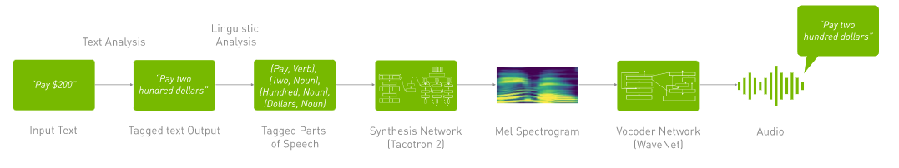

# chatbot
Se permite la interacción por voz de una chatbot mediante la API de OpenAI. Captura el audio del usuario, lo transcribe a texto, se genera una respuesta, se convierte la respuesta a voz y se reproduce. Se almacenan los mensajes en una base de datos (SQLite) y la interfaz está hecha en su mayoría con Bootstrap y Tailwind CSS. Para el funcionamiento del programa se hace uso de Pandas, Matplotlib, ReportLab, SpeechRecognition, gTTS, Pygame y la aplicación está servida con Flask.  
## Ejemplo de ejecución del programa


Enlace hacia el reporte


## Funcionamiento
### Speech to text
La voz humana genera vibraciones que viajan en ondas sonoras, las palabras tiene una combinación de frecuencias y amplitudes. Un micrófono capta estas señales y la convierte en señales analógicas. Posteriormente un convertidor de señales análogas a digitales (ADC) transforma estas señales en datos binarios para que puedan ser procesados por la computadora. Posteriormente, se descomponen los datos de audio en sonidos y mediante algoritmos  de procesamiento de lenaguaje natural y redes neuronales se encuentra la palabra más probable que se ajuste al audio.

### Text to Speech
El TTS es un proceso que convierte el texto en voz usando técnicas de procesamiento de lenguaje natural (NLP) y síntesis de voz. Se realiza una análisis de texto que normaliza la información que garantiza que el texto esté en un formato adecuado para el procesamiento. Luego, se lleva a cabo un análisis lingüistico descomponiendo el texto gramaticalmente para determinar la entonación y fluidez. Después, se usa un modelo de síntesis como Tacotron 2, lo que transforma la información en un espectrograma mel. Esta es una iamgen que representa la variación de las frecuencias de sonido a lo largo del tiempo. Finalmente, este espectrograma es procesado por un vocoder lo que genera el audio producido.



## Posibles mejoras 
- Autenticación de usuarios : Implementar login y registro con JWT o Flask-Login para que cada usuario tenga su historial de conversaciones privado.
- Uso de WebSockets para comunicación en tiempo real : Reemplazar Server-Sent Events (SSE) por Flask-SocketIO para mejorar la velocidad de respuesta y reducir latencia.
- Mejoras en la base de datos : Migrar de SQLite a PostgreSQL o MySQL para manejar más usuarios y mejorar escalabilidad. Igualmente, quedó por concluir la programación del guardado de chats y mensajes, por el momento solo guarda mensajes. 
- Análisis avanzado de conversaciones : Aplicar procesamiento de lenguaje natural (NLP) con spaCy o NLTK para detectar emociones y patrones en las conversaciones.

## Instalación de dependencias
Para la elaboración del proyecto se usó Anaconda y se fueorn instalando las dependencias una por una. Sin embargo, se pueden instalar usando requirements, ejecuta el siguiente comando : 
```bash
pip install -r requirements.txt
```

## COnfiguración de key de OPEN AI 
### Uso de dotenv

Para utilizar el chatbot con la API de OpenAI, es necesario configurar una **variable de entorno** para almacenar la clave de acceso de manera segura.

### **1️⃣ Crear un archivo `.env`**
En la raíz del proyecto, crea un archivo llamado `.env` y agrega la siguiente línea:
⚠️ **Nota:** Reemplaza `tu_api_key_aqui` con tu clave real de OpenAI.
```bash
OPENAI_API_KEY=“tu_api_key_aqui”
```
---

### **2️⃣ Instalar la librería `python-dotenv` (si aún no está instalada)**
Para cargar las variables de entorno en Python, instala `python-dotenv` con el siguiente comando:

```bash
pip install python-dotenv
```
Después agrega las siguentes lineas a consultar_api.py
```python
from dotenv import load_dotenv

# Cargar variables de entorno desde .env
load_dotenv()
```
### 🔐 Configuración de la API Key de OpenAI en `.bash_profile` (macOS/Linux)
### **1️⃣ Abrir el archivo `.bash_profile` o `.bashrc`**
Dependiendo de tu sistema, ejecuta uno de estos comandos en la terminal:

```bash
nano ~/.bash_profile   # Para macOS (Bash)
nano ~/.bashrc         # Para Linux (Bash)
nano ~/.zshrc          # Para macOS con Zsh (MacOS Catalina en adelante)
```
Agrega la siguiente línea dentro del archivo:
```bash
export OPENAI_API_KEY="tu_api_key_aqui"
```
Guarda y sal y ejecuta el siguiente comando : 
```bash
source ~/.bash_profile   # Para macOS (Bash)
source ~/.bashrc         # Para Linux (Bash)
source ~/.zshrc          # Para macOS con Zsh
```
## Ejecución del programa
Para ejecutar el programa, usa el siguiente comando en la terminal:

```bash
python app.py
```
