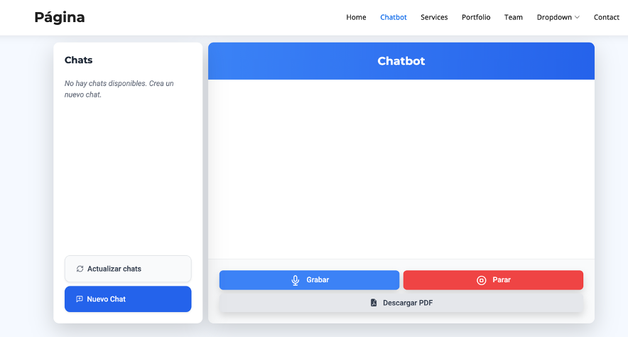

# chatbott
Se permite la interacción por voz de una chatbot mediante la API de OpenAI. Captura el audio del usuario, lo transcribe a texto, se genera una respuesta, se convierte la respuesta a voz y se reproduce. Se almacenan los mensajes en una base de datos (SQLite) y la interfaz está hecha en su mayoría con Bootstrap y Tailwind CSS. Para el funcionamiento del programa se hace uso de Pandas, Matplotlib, ReportLab, SpeechRecognition, gTTS, Pygame y la aplicación está servida con Flask.  
## Funcionamiento

