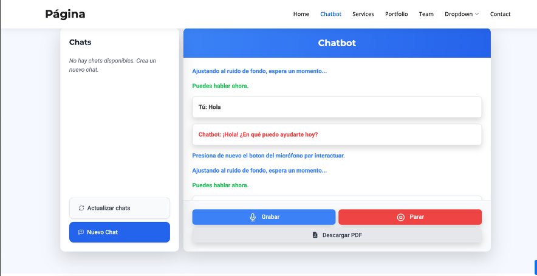
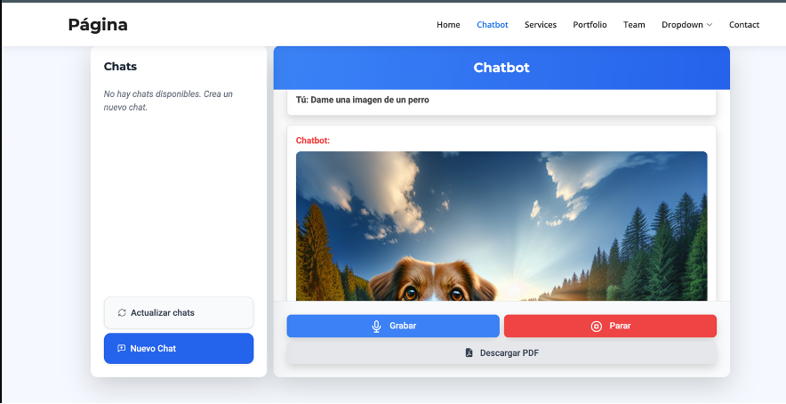

# chatbot
Se permite la interacción por voz de una chatbot mediante la API de OpenAI. Captura el audio del usuario, lo transcribe a texto, se genera una respuesta, se convierte la respuesta a voz y se reproduce. Se almacenan los mensajes en una base de datos (SQLite) y la interfaz está hecha en su mayoría con Bootstrap y Tailwind CSS. Para el funcionamiento del programa se hace uso de Pandas, Matplotlib, ReportLab, SpeechRecognition, gTTS, Pygame y la aplicación está servida con Flask.  
## Ejemplo de ejecución del programa

Enlace hacia el reporte

## Funcionamiento
### Speech to text
La voz humana genera vibraciones que viajan en ondas sonoras, las palabras tiene una combinación de frecuencias y amplitudes. Un micrófono capta estas señales y la convierte en señales analógicas. Posteriormente un convertidor de señales análogas a digitales (ADC) transforma estas señales en datos binarios para que puedan ser procesados por la computadora. Posteriormente, se descomponen los datos de audio en sonidos y mediante algoritmos  de procesamiento de lenaguaje natural y redes neuronales se encuentra la palabra más probable que se ajuste al audio.

### Text to Speech
El TTS es un proceso que convierte el texto en voz usando técnicas de procesamiento de lenguaje natural (NLP) y síntesis de voz. 
